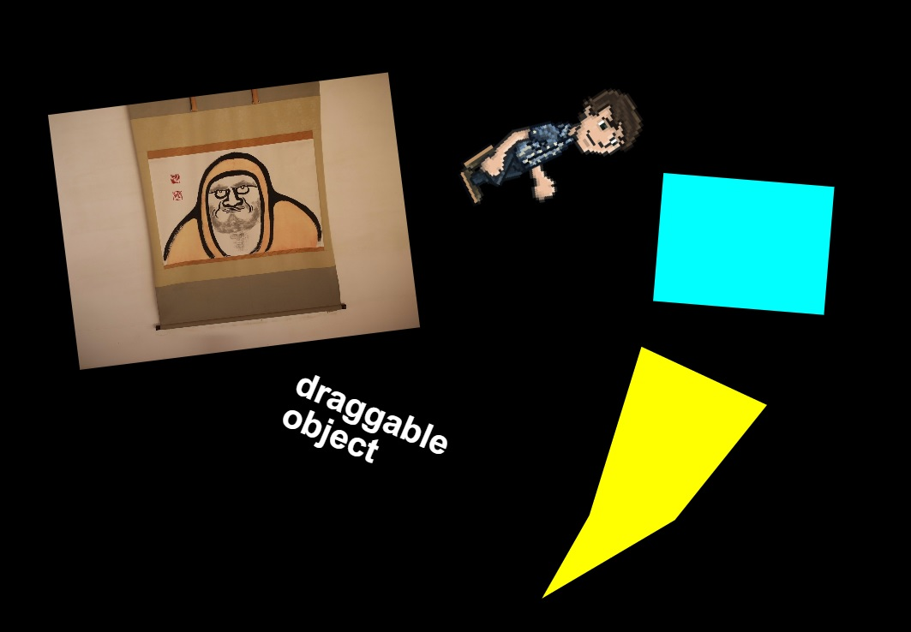

## これは



Create.js のオブジェクトを、一つのマウスまたは一本指のタッチで引きずり回せるようにする `Card` クラスを作成しました。

机の上の紙やトランプ、封筒などを一本指で触れて動かした時のように、直感的に平行移動したり、回転させたりできます。

- Bitmap
- Shape
- Sprite
- Text

など、Create.js の DisplayObject を食わせることで利用できます。

## 環境

- Create.js (Easel.js-0.8.2)

それと、趣味で TypeScript で実装しています。

## 利用法

```javascript
// 何かしらのDisplayObjectを用意する
let someObject: createjs.DisplayObject;
// Card オブジェクトを作成する
let card: Card = new Card(someObject);
// 画面に表示
this.stage.addChild(card);
```

紹介記事を作成予定です
